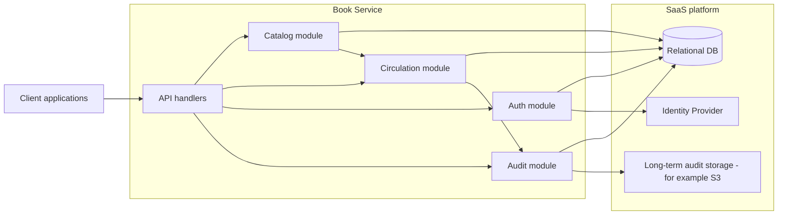
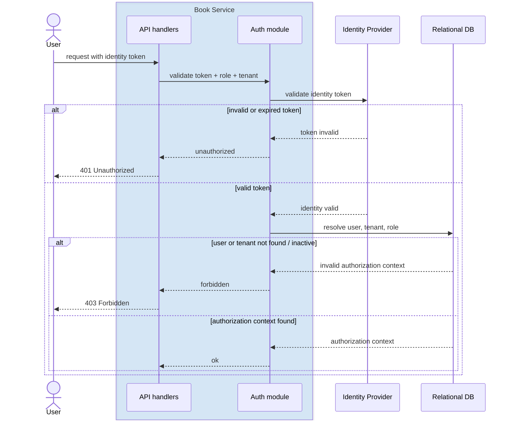
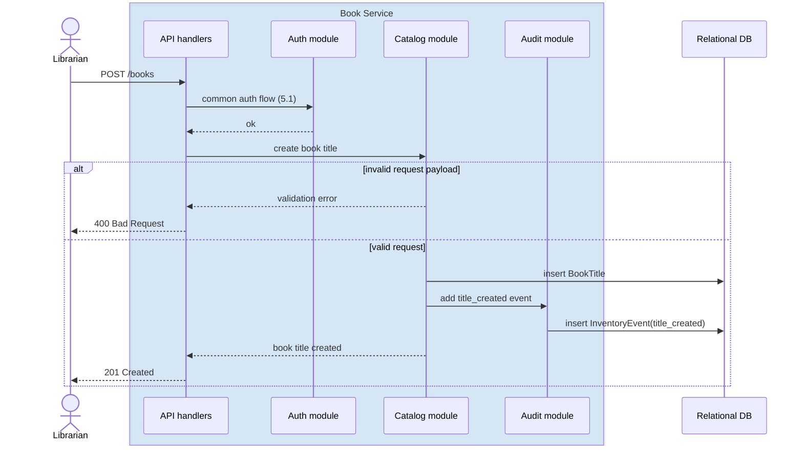
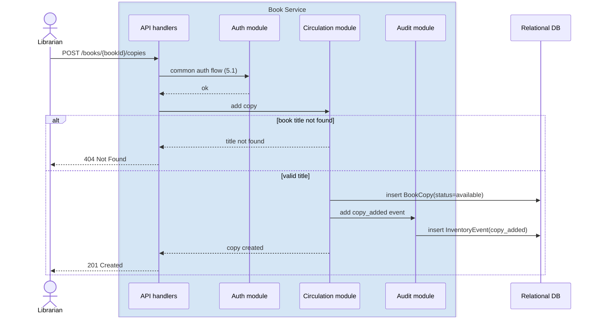
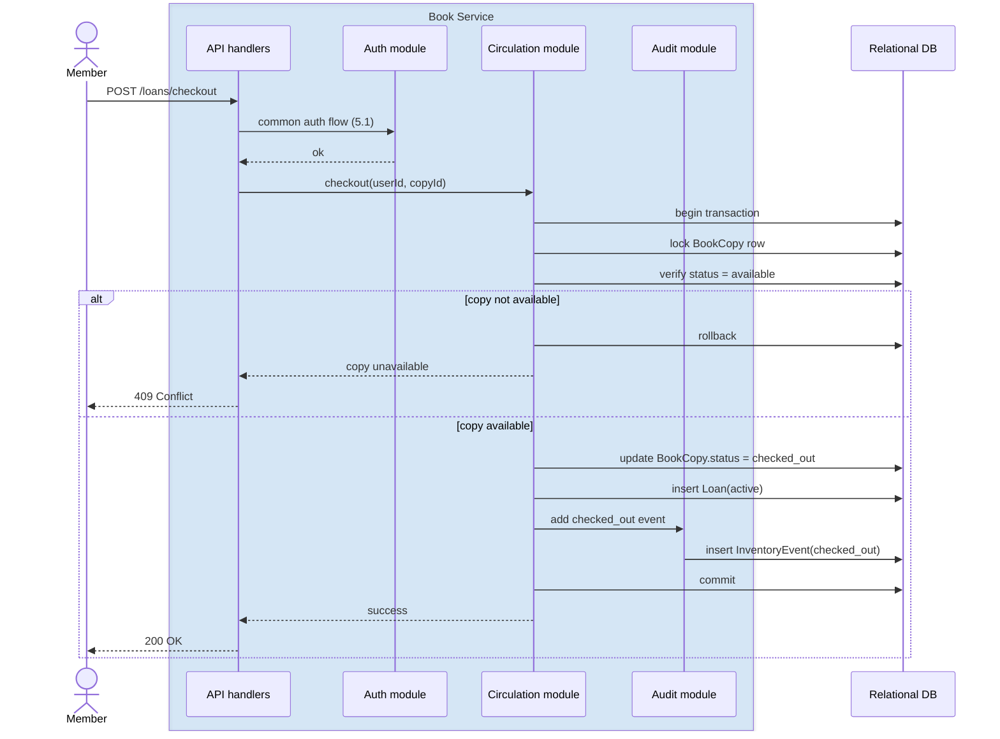
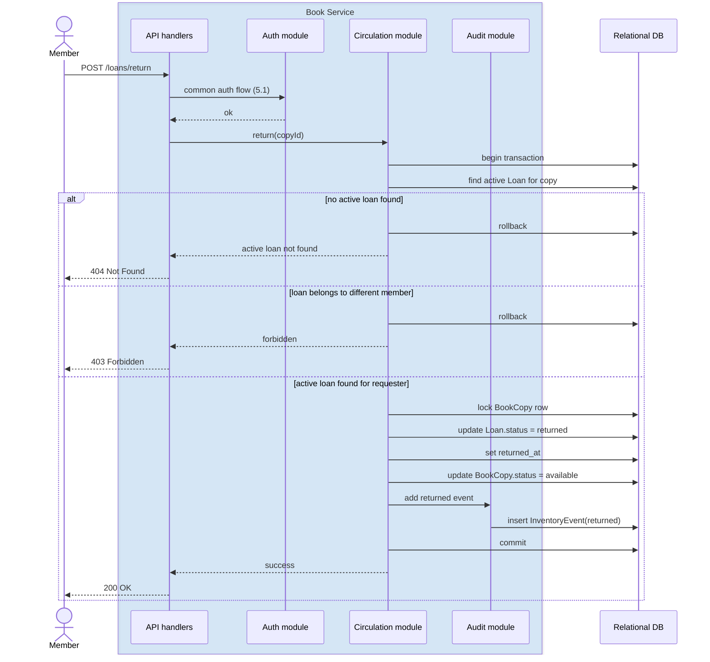
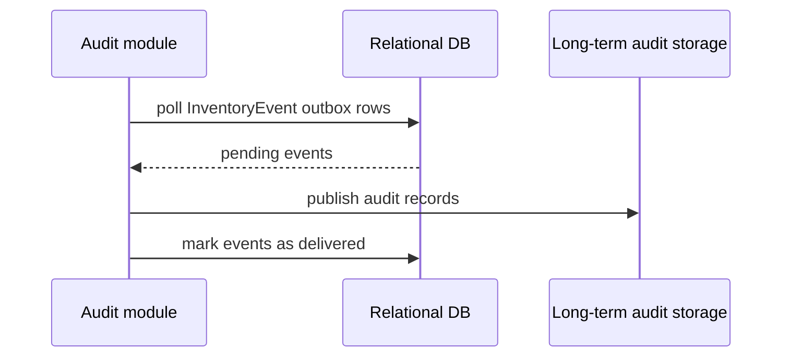
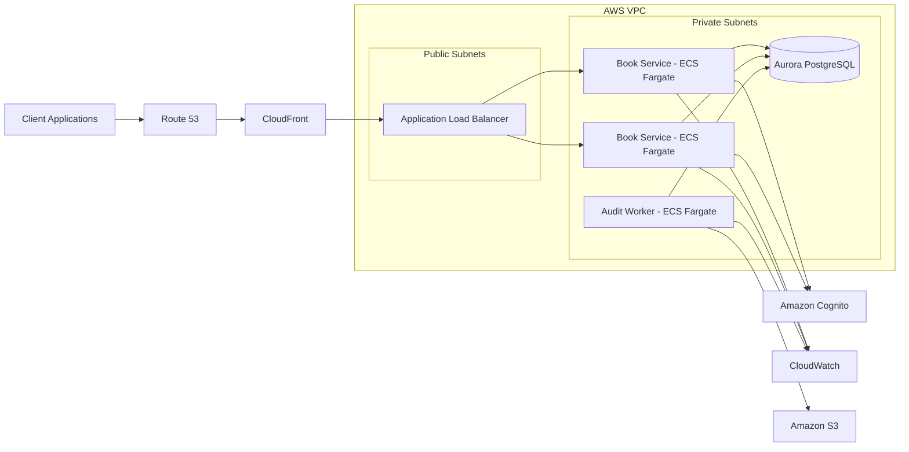

# Library Check-in / Check-out System Design

## Goal

Design a library check-in/check-out system that allows a user to:

- Check-out a book.
- Return a book that they have checked-out.
- Add a book to the system.

Design should list:

- Any microservices used.
- Physical and logical design.
- AWS services that would be used if the system needs to be a SaaS solution
- Assumption or design constraints.
- Architectural principles that you would consider if the system is mission-critical.
- Any sequence diagrams (as needed).

---

## Contents

- [1. Domain research](#1-domain-research)
- [2. Assumptions and design constraints](#2-assumptions-and-design-constraints)
- [3. High-level logical design](#3-high-level-logical-design)
- [4. Models](#4-models)
- [5. Sequence diagrams](#5-sequence-diagrams)
- [6. Physical design](#6-physical-design)
- [7. Potential optimizations](#7-potential-optimizations)
- [8. Performance considerations](#8-performance-considerations)
- [9. Monitoring and observability](#9-monitoring-and-observability)
- [10. Architectural principles if the system is mission-critical](#10-architectural-principles-if-the-system-is-mission-critical)
- [11. Design scope](#11-design-scope)
- [12. Final note](#12-final-note)

---

## 1. Domain research

Before thinking about system design or infrastructure, it is important to understand how libraries usually operate in practice.

### 1.1 How libraries usually operate

- Libraries manage both book titles and physical copies.
- Availability of a book title depends on whether a copy is currently available, not only on whether the title exists in the catalog.
- A single title may have multiple copies, and each copy may have a different status.
- Many libraries operate across multiple branches, so copies may belong to a specific location and may be returned to a different branch if it is allowed.
- The main day-to-day activities are adding books, checking books out, and accepting returns.
- Libraries typically have different user roles, such as members, librarians, and administrators.
- When a book is borrowed, the library needs to track the borrower, checkout date, due date, and return status.
- Users usually search by title, author, subject, or International Standard Book Number (ISBN), but they borrow a specific copy.
- Libraries care a lot about search and discoverability. A member or staff may search by: title, author, subject, ISBN, category

### 1.2 Sizing assumptions

| Scope | Indicative stats |
|---|---|
| Worldwide library landscape | Libraries exist in the tens of thousands globally, with circulation volumes in the hundreds of millions to billions of items per year across all library systems combined. |
| Typical tenant in this design | 1 to 50 branches |
| Typical tenant catalog size | 10,000 to 1,000,000 titles |
| Typical tenant physical inventory | 20,000 to 2,000,000 copies |
| Typical tenant circulation volume | A few hundred to a few thousand checkouts/returns per day |
| Traffic pattern | Noticeable spikes during school terms, weekends, and opening hours |

## 2. Assumptions and design constraints

### Functional assumptions

- The system tracks physical copies of books, not just titles.
- A title can have multiple copies.
- A user checks out a single available copy.
- A returned book must correspond to an active checkout.
- Only librarians or staff can add books/copies.
- Library members can search, check availability, and check out books.
- A library tenant may operate one or more branches.

### Non-functional assumptions

- Correctness matters more than extreme scale.
- The most important rule is: the same copy must not be checked out twice at the same time.
- The system may be used as a SaaS product by multiple library organizations.

### Design constraints

- Checkout and return should be transactional.
- Return should be idempotent where possible.
- The system should keep an audit trail of inventory-changing operations.
- In SaaS mode, tenants must be isolated from each other.
- The design should reflect normal day-to-day library operations without unnecessary complexity.

---

## 3. High-level logical design

This design is centered on the main functional requirements of the exercise, while also covering supporting capabilities such as search, audit, and platform concerns at a practical level without making them the main focus of the solution.

The initial design uses one modular service plus one background worker for audit processing, rather than separate business microservices.

### 3.1 Components diagram

The following diagram shows the dependency view of the main service, its internal modules, and the surrounding SaaS platform components.

### 3.2 Functional scope

Main requirements:
- Add a book title
- Add a book copy
- Checkout a book copy
- Return a book copy

Additional nice to have capabilities:
- Search books by title, author, ISBN, or category

SaaS and platform requirements:
- Tenant onboarding
- User registration
- Authentication and authorization
- Audit logging

### 3.3 Flows

| # | Flows | Design details |
|---|---|---|
|  | Main flows |  |
| 1 | Add a book title | <ul><li>Staff adds a book title with metadata such as title, author, ISBN, publisher, and category.</li><li>The title becomes searchable in the catalog and can later be used to create one or more physical copies.</li></ul> |
| 2 | Add a book copy | <ul><li>Staff creates a physical copy for an existing book title.</li><li>Each copy is associated with a branch and a unique barcode.</li><li>The copy starts with an <code>available</code> status and can then participate in circulation flows.</li></ul> |
| 3 | Checkout a book copy | <ul><li>A copy can be checked out only if its current status is <code>available</code>.</li><li>The system validates the user, confirms availability, updates the copy status, creates the loan record, writes an audit event, and commits the transaction.</li><li>The copy row is locked during the operation to prevent two users from checking out the same copy at the same time.</li></ul> |
| 4 | Return a book copy | <ul><li>The system finds the active loan for the copy and validates that it belongs to the requesting user. Librarians can return any active loan.</li><li>It then marks the loan as returned, updates the copy status back to <code>available</code>, writes an audit event, and commits the transaction.</li><li>The return flow should be idempotent so that retries do not create duplicate return operations.</li></ul> |
|  | Search, SaaS and platform flows |  |
| 5 | Search books | <ul><li>Users can search books by title, author, ISBN, or category.</li><li>Search is an important supporting capability for real usage, but it is not the main focus of this exercise compared to add, checkout, and return flows.</li></ul> |
| 6 | Tenant onboarding | <ul><li>A new library organization is registered as a tenant.</li><li>The system creates the tenant record, a default branch, and the initial admin account.</li><li>The tenant admin then manages branches and users inside that tenant.</li></ul> |
| 7 | User registration | <ul><li>Tenant admins create or invite librarians and members.</li><li>Each user is attached to a specific tenant.</li><li>Users may also be associated with a branch if needed.</li><li>The application keeps its own user profile and role information.</li></ul> |
| 8 | Authentication and authorization | <ul><li>Use an out-of-the-box identity provider such as Amazon Cognito for sign-in, password flows, token issuance, and MFA if needed.</li><li>The application still keeps its own <code>users</code> table for tenant membership, branch association, library role, and local account status.</li><li>Authorization stays in the application layer.</li><li>Role model: <code>member</code> can search the catalog, check availability, check out books, return books, and access their own account; <code>librarian</code> can add books/copies and support circulation operations; <code>admin</code> can manage users, branches, and tenant-level settings.</li></ul> |
| 9 | Audit logging | <ul><li>The system records key operational events such as book creation, checkout, return, and tenant/user administration changes.</li><li>Operational events are first written into an outbox table inside the main transactional database.</li><li>A separate background process reads events from the outbox table and publishes them to long-term audit storage.</li><li>This uses the outbox pattern to keep the core business transaction and audit event creation consistent.</li></ul> |

The flows are described in more detail in section 5, Sequence diagrams.

### 3.4 Main service (Book Service)

This design uses one backend service split into clear logical parts, rather than multiple deployable microservices.

#### 3.4.1 Why one service is used here

A single service is a better fit for this problem because the domain is still compact and the most important workflows are highly transactional.

Checkout and return are the critical operations in the system. Keeping the related logic in one service makes the behavior easier to implement, test, and reason about.

This approach also reduces operational complexity:
- one deployment unit
- one codebase
- one main transactional boundary
- easier debugging and monitoring

A multi-service design would introduce extra complexity early:
- service-to-service communication
- more deployment and monitoring overhead
- more complicated failure handling
- harder cross-service consistency

For this system, that complexity is not necessary at the beginning. A modular service with clear internal boundaries gives a cleaner balance between simplicity and correctness.

If the system grows later, the natural evolution path would be to separate:
- tenant/user management
- catalog
- circulation

#### 3.4.2 Logical parts of the service

##### 3.4.2.1 API handlers
Handles:
- receiving client requests
- validating request shape and input
- routing requests to the correct internal module
- returning responses to clients

##### 3.4.2.2 Catalog management
Handles:
- adding book titles
- storing metadata such as title, author, and ISBN
- searching and listing books

##### 3.4.2.3 Circulation management
Handles:
- physical copies
- availability
- checkout
- return
- loan lifecycle

##### 3.4.2.4 Audit
Handles:
- writing audit events into the outbox table
- background processing of outbox events
- delivery of audit records into audit storage

This follows the outbox pattern: the business flow writes its audit event into the same relational database transaction, and a separate background process later publishes that event to audit storage.

### 3.5 SaaS and platform integration
#### 3.5.1 Tenant and user management
Handles:
- tenant onboarding
- branch management
- user registration
- roles and permissions
- identity provider integration

#### 3.5.2 Audit storage
Handles:
- long-term storage for audit events after they are published from the outbox

---

## 4. Models

### 4.1 Core models

| Model | Fields |
|---|---|
| BookTitle | <ul><li><code>book_id</code> — primary key</li><li><code>tenant_id</code></li><li><code>isbn</code></li><li><code>title</code></li><li><code>author</code></li><li><code>publisher</code></li><li><code>category</code></li></ul> |
| BookCopy | <ul><li><code>copy_id</code> — primary key</li><li><code>tenant_id</code></li><li><code>book_id</code></li><li><code>barcode</code> — unique within tenant</li><li><code>branch_id</code></li><li><code>status</code> (<code>available</code>, <code>checked_out</code>, <code>lost</code>, <code>maintenance</code>)</li></ul> |
| Tenant | <ul><li><code>tenant_id</code> — primary key</li><li><code>name</code> — unique key</li><li><code>status</code></li><li><code>plan</code></li><li><code>created_at</code></li></ul> |
| Branch | <ul><li><code>branch_id</code> — primary key</li><li><code>tenant_id</code></li><li><code>name</code> — unique key within tenant</li><li><code>address</code></li><li><code>status</code></li><li><code>created_at</code></li></ul> |
| User | <ul><li><code>user_id</code> — primary key</li><li><code>tenant_id</code></li><li><code>branch_id</code></li><li><code>name</code></li><li><code>email</code> — unique key within tenant</li><li><code>role</code> (<code>member</code>, <code>librarian</code>, <code>admin</code>)</li><li><code>status</code></li><li><code>created_at</code></li></ul> |
| Loan | <ul><li><code>loan_id</code> — primary key</li><li><code>tenant_id</code></li><li><code>copy_id</code></li><li><code>user_id</code></li><li><code>checkout_at</code></li><li><code>due_at</code></li><li><code>returned_at</code></li><li><code>status</code> (<code>active</code>, <code>returned</code>, <code>overdue</code>)</li></ul> |
| InventoryEvent | <ul><li><code>event_id</code> — primary key</li><li><code>tenant_id</code></li><li><code>copy_id</code></li><li><code>event_type</code></li><li><code>actor_id</code></li><li><code>timestamp</code></li><li><code>metadata</code></li><li><code>delivery_status</code></li></ul> |

### 4.2 Key model relationships

- A `Tenant` owns branches, users, books, copies, loans, and events.
- A `Branch` belongs to a tenant.
- A `User` belongs to a tenant and may optionally be associated with a branch.
- A `BookTitle` belongs to a tenant and may have many physical copies.
- A `BookCopy` belongs to one title and one branch.
- A `Loan` connects a user to a specific copy.
- An `InventoryEvent` acts as the outbox table for important operational events.

### 4.3 Model notes

#### Title vs copy

A title and a copy are different things:

- BookTitle = "The Hobbit"
- BookCopy = physical copy with barcode `BUL-001-8842`

That separation keeps checkout logic correct.

#### Data integrity rules

- a book copy can have at most one active loan at a time
- barcode should be unique within a tenant
- checkout and return update both `BookCopy` and `Loan` in the same transaction

#### Tenant and user model

- each library organization is a separate tenant
- each tenant owns its own branches, users, books, copies, and loans
- all business data is scoped by `tenant_id`
- tenant admins manage users and branches only inside their own tenant
- user roles are `member`, `librarian`, and `admin`

#### Branch model

- a tenant can have one or more branches
- a copy belongs to a branch
- a user may optionally be attached to a home branch
- branch-level restrictions can be added if the operating model requires them

---

## 5. Sequence diagrams

This section focuses on the main business flows of the system. SaaS administration flows such as tenant onboarding and user setup are acknowledged in the design, but they are intentionally kept out of scope here so the sequence diagrams stay focused on the core library operations.

## 5.1 Common authentication and authorization flow

## 5.2 Add a book title

## 5.3 Add a book copy

## 5.4 Checkout a book copy

## 5.5 Return a book copy

## 5.6 Publish audit events from outbox

---

## 6. Physical design

The system is deployed as a small AWS-based SaaS application with one main stateless service, one background worker, and one relational database.

### 6.1 Deployment view

- Client applications access the system through Route 53, CloudFront, and an Application Load Balancer.
- The main Book Service runs as multiple ECS Fargate tasks distributed across multiple Availability Zones.
- A separate background worker also runs on ECS Fargate and processes outbox/audit events asynchronously.
- The transactional database is Amazon Aurora PostgreSQL deployed in Multi-AZ mode.
- Amazon Cognito is used for authentication and token issuance.
- Amazon S3 can be used for long-term audit export, reports, and backups.
- AWS Secrets Manager stores database credentials and application secrets.
- Amazon CloudWatch collects logs, metrics, and alarms.

### 6.2 Network layout

- The Application Load Balancer is deployed in public subnets.
- The Book Service, background worker, and Aurora PostgreSQL run in private subnets.
- Only the load balancer is publicly exposed.
- Internal components communicate over private network paths.

### 6.3 Scaling and availability

- The Book Service scales horizontally because it is stateless.
- The background worker can scale independently from the main API service.
- Aurora PostgreSQL provides high availability through Multi-AZ deployment.
- Read replicas can be added later if reporting or catalog search becomes heavier.

### 6.4 Why this physical design fits the problem

This deployment keeps the system simple while still supporting the most important requirement: correct and reliable checkout/return transactions. It also matches the modular-monolith approach of the logical design, avoids unnecessary platform complexity, and gives a clear path for future scaling.

### 6.5 Physical deployment diagram

---

## 7. Potential optimizations

Possible improvements that could be introduced later include:

- keeping book titles in a shared global catalog instead of storing title metadata separately for each library tenant
- storing only tenant-specific copy, branch, loan, and circulation data inside each library tenant scope
- reusing common title metadata across libraries when multiple libraries carry the same books
- adding caching for frequently accessed catalog and availability queries
- introducing read replicas for reporting or heavier search workloads

A practical optimization here is to separate book title metadata from tenant-specific inventory. In that model, book titles could be stored once in a common catalog shared across all libraries, while each library would still keep its own copies, branches, loans, and users.

### Search optimization

If search becomes more important, the following fields are good candidates for indexing or dedicated search optimization:

- `BookTitle.title`
- `BookTitle.author`
- `BookTitle.isbn`
- `BookTitle.category`
- `BookCopy.barcode`
- `BookCopy.status`
- `BookCopy.branch_id`
- `User.email`
- `Loan.user_id`
- `Loan.copy_id`
- `Loan.status`

---

## 8. Performance considerations

The most performance-sensitive parts of this system are the circulation flows.

### Main considerations
- checkout and return should remain fast and transactional
- book copy lookup by barcode or copy id should be indexed
- book title search should support common lookups such as title, author, and ISBN
- tenant_id should be part of important filtering and indexing strategy
- audit logging should not slow down the core circulation path significantly

### Read vs write profile
- catalog browsing and search are read-heavy
- checkout and return are write-sensitive but lower in volume than search
- tenant and user management are relatively low-volume administrative operations

### Practical performance measures
- index copy, loan, and tenant-scoped lookup fields
- cache frequently accessed catalog queries if needed
- use read replicas for heavier read traffic or reporting
- keep the checkout and return path as short as possible
- monitor database lock contention around circulation operations

---

## 9. Monitoring and observability

A production version of this system should make the most important operational signals visible.

### Core metrics
- checkout success and failure rate
- return success and failure rate
- add-title and add-copy success rate
- request latency by endpoint
- database latency and connection health
- lock contention during circulation operations

### Logs and audit visibility
- application logs for request and error tracking
- structured logs for important business actions
- audit event visibility for checkout, return, book creation, and tenant/user administration changes

### Alerts
- spike in failed checkout or return requests
- database latency above threshold
- audit write failures
- authentication failures above normal baseline

---

## 10. Architectural principles if the system is mission-critical

If this becomes mission-critical, I would focus on the following:

### 1. Inventory correctness first
A book copy must never appear available and checked out at the same time.

### 2. Strong transactional boundaries
Checkout and return should have strong transactional boundaries.

### 3. Idempotency
Retries should not corrupt inventory state.

### 4. Auditability
Every inventory-changing event should be traceable.

### 5. High availability
- multi-AZ database
- multiple stateless service instances
- outbox-backed async processing

### 6. Backup and recovery
- regular database backups and point-in-time recovery should be enabled
- audit data stored in long-term storage should be retained independently from the transactional database
- recovery procedures should be documented and tested

### 7. Graceful degradation
If non-critical background audit processing is delayed, checkout/return should still succeed.

### 8. Security and tenant isolation
- strict authn/authz
- tenant filters everywhere
- encryption at rest and in transit
- secrets in managed stores

### 9. Observability
Track:
- checkout failures
- lock contention
- return failures
- DB latency
- tenant-specific error rates

---

## 11. Design scope

This solution is intentionally centered on the core requirements of the exercise:
- add a book title
- add a book copy
- checkout a book copy
- return a book copy

It uses one modular backend service, one relational database, and a background worker for audit processing. The design can evolve later if scale or product scope grows.

---

## 12. Final note

A modular design around Catalog, Circulation, and tenant-aware access control, backed by PostgreSQL, provides a good balance of simplicity and correctness for this problem. The most important technical requirement is preventing invalid inventory state while keeping the system easy to operate and extend.
